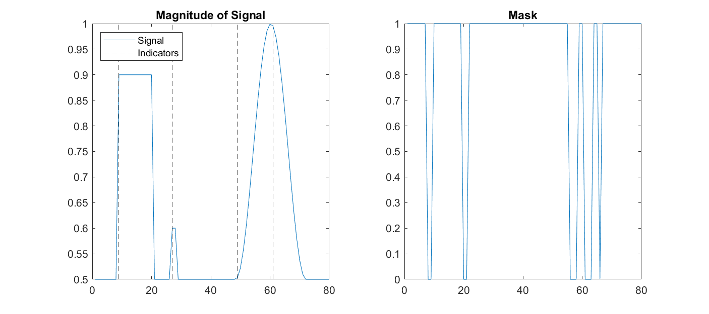
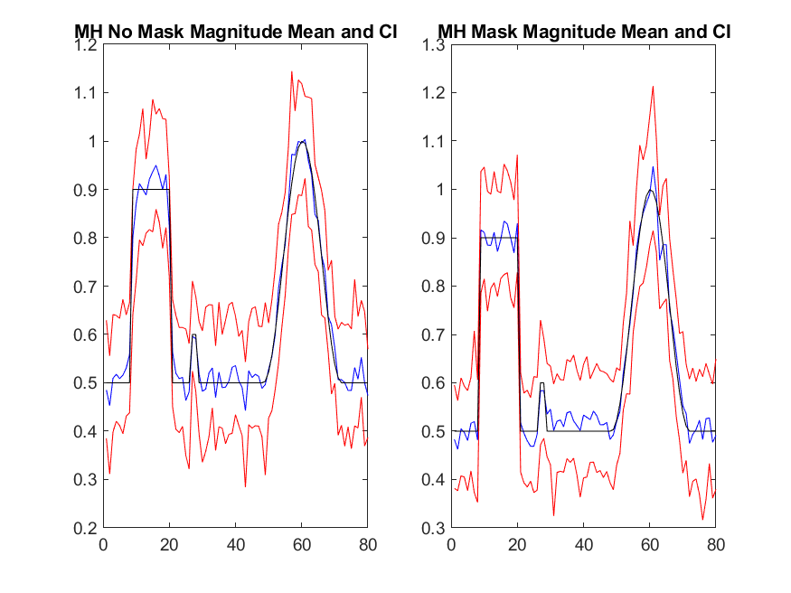
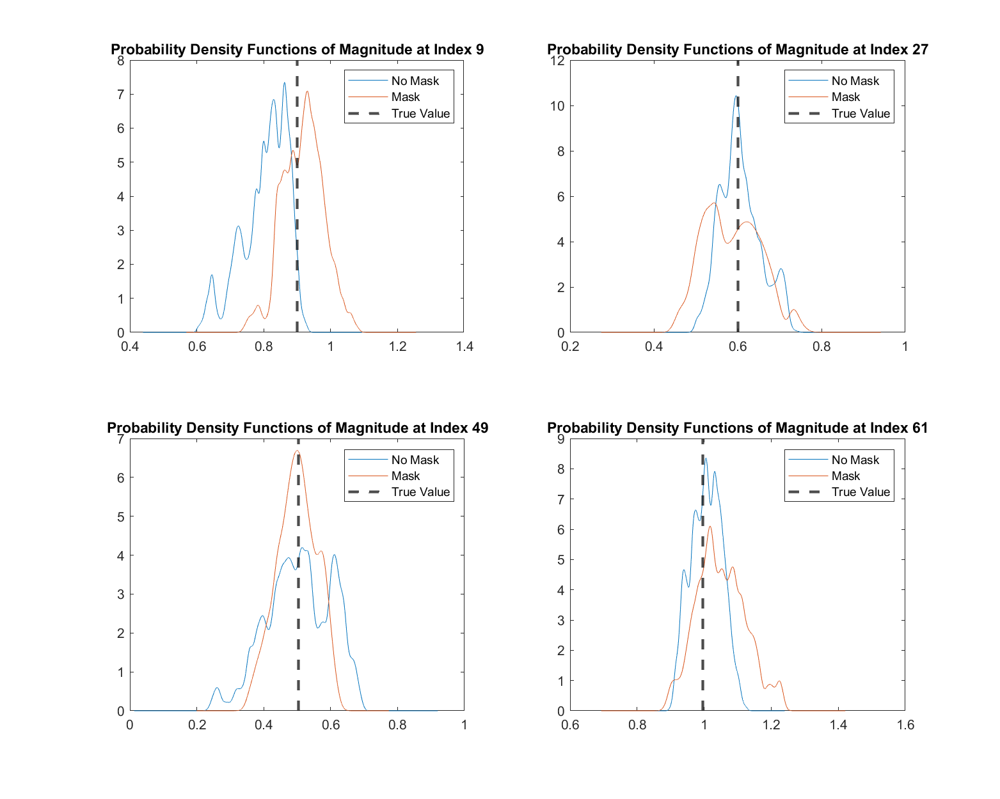

# EmpiricalBayesianInference

This program seeks to use an empirical Bayesian approach to reconstruct signals from multiple measurement vectors (MMVs) of Fourier data assuming joint sparsity in the MMVs. The original work by [Zhang et al.](https://arxiv.org/abs/2103.15618) performed this process for real signals using variance-based joint sparsity (VBJS) to identify the support of the sparse domain to form the prior and the Metropolis Hastings MCMC algorithm to sample from the posterior of the signal. The signals considered here were either 1D and sparse in the signal or edge domain or were 2D and sparse in the signal domain.

This work seeks to expand on this approach by considering both real and complex signals, 2D signals that are sparse in the edge domain, forming the posterior in either the signal or frequency domains, and sampling using Hamiltonian MC. The software currently does not efficiently support the sampling of signals with length much larger than 500.

Below we feature an example of a few of the images from the program. The example is a complex signal with additive noise, magnitude sparse in edges, phase random, with 20 MMVs. We use the l2 prior, and we solve in the signal domain using the Metropolis Hastings MCMC algorithm. The left panel in the first figure demonstrates the true signal, and the right panel demonstrates the mask we construct.

The figure below is our reconstruction with 95% confidence intervals placed around the mean of the chain following the burn-in period.

The last figure selects four points, indicated on the first figure, and plots the approximate recovered probability density functions using kernel density estimation.

